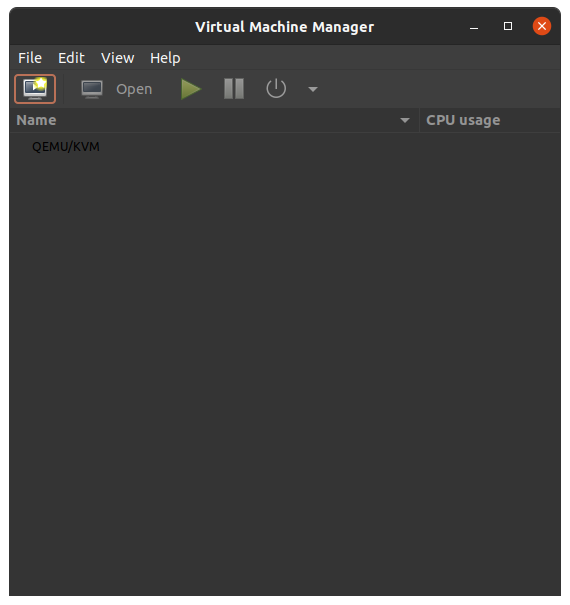
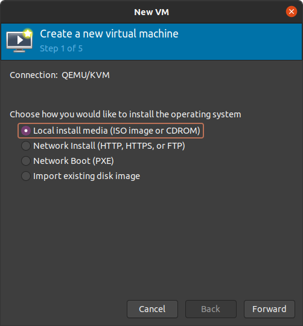
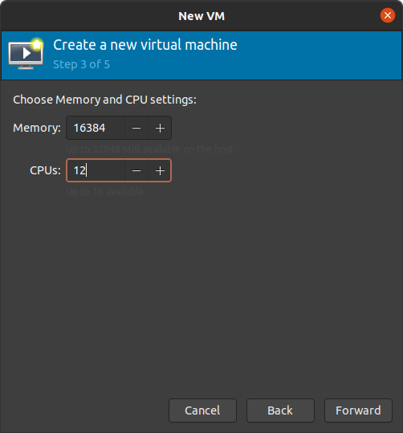
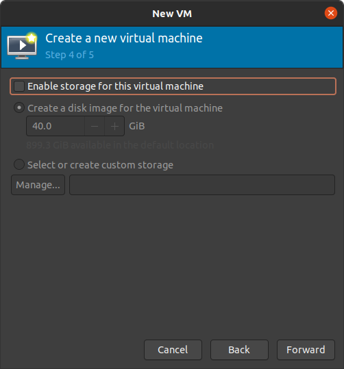
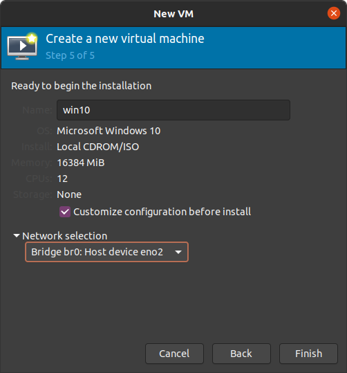
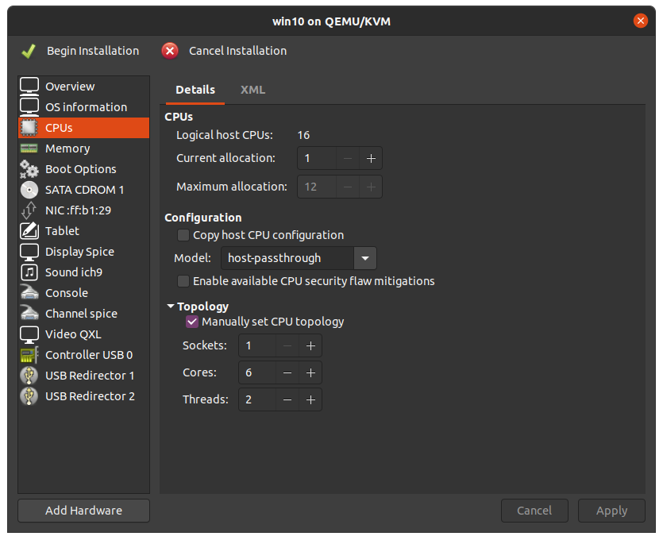

# Windows10 KVM Guest using OVMF that has a vfio-pci GPU passed through Guide


# Hardware
| Component Type  | Model |
| --------------  | ----- |
| CPU             | i9-9900KF |
| MOBO            | MSI MPG Z390 Gaming Edge AC (MS-7B17) |
| GPU     (GUEST) | RTX 2080 |
| GPU     (HOST)  | GTX 980Ti |
| Storage (GUEST) | NVME M.2 Drive |
| Storage (HOST)  | SATA SSD Drive |

---

# Setup

## Step 1) Hook up required Hardware
* Plug Host GPU is in PCIe slot 1
* Plug Guest GPU in PCIe slot 2
* Plug one monitor into first GPU, second monitor into second GPU
* have two drives (one for Ubuntu host, one for Win10 guest)
  * **NOTE:** I am using NVME for Win10 guest, Sata SSD for Ubuntu host because my motherboard
  has only one IOMMU group for the sata controller. To circumvent this, you could purchase a PCIe->SATA adapter and pass through the PCIe->SATA device

---

## Step 2) Enable BIOS/UEFI features
* Enable Intel VT-x and VT-d (For AMD chips it should be called SVM)

---

## Step 5) Install Ubuntu 20.04

After installing Ubuntu 20.04, install the required software:
```bash
$ sudo apt install qemu-kvm \
                   qemu-utils \
                   libvirt-daemon-system \
                   libvirt-clients \
                   bridge-utils \
                   virt-manager \
                   ovmf \
                   -y
```

---

## Step 6) *build and compile linux kernel with ACS patch
*Only if your motherboard/cpu does not properly separate IOMMU groups

**NOTE:** using ACS patched kernel is a major security violation because it may potentially allow DMA to devices the VM should not have access to. This roughly translates to creating a way to break out from the guest VM to a host VM.

to do this, simply run this script from mdPlusPlus:
https://gist.github.com/mdPlusPlus/031ec2dac2295c9aaf1fc0b0e808e21a

Choose Keep local version currently installed. Then I selected this for the following:

```
Do you want to get a [s]table, the newest [m]ainline release candidate or the newest kernel from your [r]epositories? [S/m/r] S
Do you want to apply the acs override patch? Kernels below 4.10 are not supported. [Y/n] Y
Do you want to apply the experimental AMD AGESA patch to fix VFIO setups on AGESA 0.0.7.2 and newer? [y/N] N
Do you want to apply the experimental AMD Vega PCI reset patch? [y/N] N
Do you want to install the kernel and its headers after compilation? [Y/n] Y
Do you want to make this kernel the new default? [Y/n] Y
The newest available stable kernel version is 5.8.12. Kernels below 4.10 are not supported.
Which version do you want to download? [5.8.12]
```
I just pressed enter at the end to install the 5.8.12 kernel in my case

After rebooting, you should see your kernel has updated:
```bash
$ uname -r
5.8.12-acso
```

---

## Step 7) enable IOMMU separation and pass GPU PCI ID to vfio
### a) enable IOMMU in grub

```bash
$ sudo vim /etc/default/grub
```

add `intel_iommu=on iommu=pt pcie_acs_override=downstream,multifunction` to GRUB_CMDLINE_LINUX. Example below:

**NOTE:** you do not need `pcie_acs_override=downstream,multifunction` if you are not using acs patched kernel
```bash
---
GRUB_CMDLINE_LINUX_DEFAULT="quiet splash"
GRUB_CMDLINE_LINUX="intel_iommu=on iommu=pt pcie_acs_override=downstream,multifunction"
---
```


### b) update grub and reboot
```bash
$ sudo update-grub
$ reboot
```

### c) determine GPU PCI ID and add to grub

Determine IOMMU groupings with following command:
```bash
shopt -s nullglob
for d in /sys/kernel/iommu_groups/{0..999}/devices/*; do
    n=${d#*/iommu_groups/*}; n=${n%%/*}
    printf 'IOMMU Group %s ' "$n"
    lspci -nns "${d##*/}"
done;
```

Find the GPU you want to passthrough with its audio controller. Example below:
```
IOMMU Group 0 00:00.0 Host bridge [0600]: Intel Corporation 8th Gen Core 8-core Desktop Processor Host Bridge/DRAM Registers [Coffee Lake S] [8086:3e30] (rev 0a)
IOMMU Group 1 00:01.0 PCI bridge [0604]: Intel Corporation Xeon E3-1200 v5/E3-1500 v5/6th Gen Core Processor PCIe Controller (x16) [8086:1901] (rev 0a)
IOMMU Group 2 00:01.1 PCI bridge [0604]: Intel Corporation Xeon E3-1200 v5/E3-1500 v5/6th Gen Core Processor PCIe Controller (x8) [8086:1905] (rev 0a)
IOMMU Group 3 00:08.0 System peripheral [0880]: Intel Corporation Xeon E3-1200 v5/v6 / E3-1500 v5 / 6th/7th/8th Gen Core Processor Gaussian Mixture Model [8086:1911]
IOMMU Group 4 00:12.0 Signal processing controller [1180]: Intel Corporation Cannon Lake PCH Thermal Controller [8086:a379] (rev 10)
IOMMU Group 5 00:14.0 USB controller [0c03]: Intel Corporation Cannon Lake PCH USB 3.1 xHCI Host Controller [8086:a36d] (rev 10)
IOMMU Group 5 00:14.2 RAM memory [0500]: Intel Corporation Cannon Lake PCH Shared SRAM [8086:a36f] (rev 10)
IOMMU Group 6 00:14.3 Network controller [0280]: Intel Corporation Wireless-AC 9560 [Jefferson Peak] [8086:a370] (rev 10)
IOMMU Group 7 00:16.0 Communication controller [0780]: Intel Corporation Cannon Lake PCH HECI Controller [8086:a360] (rev 10)
IOMMU Group 8 00:17.0 SATA controller [0106]: Intel Corporation Cannon Lake PCH SATA AHCI Controller [8086:a352] (rev 10)
IOMMU Group 9 00:1d.0 PCI bridge [0604]: Intel Corporation Cannon Lake PCH PCI Express Root Port #9 [8086:a330] (rev f0)
IOMMU Group 10 00:1f.0 ISA bridge [0601]: Intel Corporation Z390 Chipset LPC/eSPI Controller [8086:a305] (rev 10)
IOMMU Group 10 00:1f.3 Audio device [0403]: Intel Corporation Cannon Lake PCH cAVS [8086:a348] (rev 10)
IOMMU Group 10 00:1f.4 SMBus [0c05]: Intel Corporation Cannon Lake PCH SMBus Controller [8086:a323] (rev 10)
IOMMU Group 10 00:1f.5 Serial bus controller [0c80]: Intel Corporation Cannon Lake PCH SPI Controller [8086:a324] (rev 10)
IOMMU Group 10 00:1f.6 Ethernet controller [0200]: Intel Corporation Ethernet Connection (7) I219-V [8086:15bc] (rev 10)
IOMMU Group 11 01:00.0 VGA compatible controller [0300]: NVIDIA Corporation GF108 [GeForce GT 730] [10de:0f02] (rev a1)
IOMMU Group 12 01:00.1 Audio device [0403]: NVIDIA Corporation GF108 High Definition Audio Controller [10de:0bea] (rev a1)
IOMMU Group 13 02:00.0 VGA compatible controller [0300]: NVIDIA Corporation TU104 [GeForce RTX 2080 Rev. A] [10de:1e87] (rev a1)
IOMMU Group 14 02:00.1 Audio device [0403]: NVIDIA Corporation TU104 HD Audio Controller [10de:10f8] (rev a1)
IOMMU Group 15 02:00.2 USB controller [0c03]: NVIDIA Corporation TU104 USB 3.1 Host Controller [10de:1ad8] (rev a1)
IOMMU Group 16 02:00.3 Serial bus controller [0c80]: NVIDIA Corporation TU104 USB Type-C UCSI Controller [10de:1ad9] (rev a1)
IOMMU Group 17 03:00.0 Non-Volatile memory controller [0108]: Samsung Electronics Co Ltd NVMe SSD Controller SM981/PM981/PM983 [144d:a808]
```

I am paying attention to the numbers before (rev a1), those are the PCI device IDs. I want to tell vfio to grab these PCI devices. So again we will modify /etc/default/grub by adding `vfio-pci.ids=10de:1e87,10de:10f8` to GRUB_CMDLINE_LINUX as such:

```bash
---
GRUB_CMDLINE_LINUX_DEFAULT="quiet splash"
GRUB_CMDLINE_LINUX="intel_iommu=on iommu=pt pcie_acs_override=downstream,multifunction vfio-pci.ids=10de:1e87,10de:10f8"
---
```

### d) update grub and reboot again

```bash
$ sudo update-grub
$ reboot
```

### e) verify vfio-pci is controlling GPU


Run the following command to list pci devices and their info:

```bash
$ lspci -nnv
```

```bash
---
02:00.0 VGA compatible controller [0300]: NVIDIA Corporation TU104 [GeForce RTX 2080 Rev. A] [10de:1e87] (rev a1) (prog-if 00 [VGA controller])
	Subsystem: ASUSTeK Computer Inc. TU104 [GeForce RTX 2080 Rev. A] [1043:8660]
	Flags: fast devsel, IRQ 10
	Memory at b2000000 (32-bit, non-prefetchable) [disabled] [size=16M]
	Memory at 90000000 (64-bit, prefetchable) [disabled] [size=256M]
	Memory at a0000000 (64-bit, prefetchable) [disabled] [size=32M]
	I/O ports at 3000 [disabled] [size=128]
	Expansion ROM at b3000000 [disabled] [size=512K]
	Capabilities: <access denied>
	Kernel driver in use: vfio-pci
	Kernel modules: nvidiafb, nouveau

02:00.1 Audio device [0403]: NVIDIA Corporation TU104 HD Audio Controller [10de:10f8] (rev a1)
	Subsystem: ASUSTeK Computer Inc. TU104 HD Audio Controller [1043:8660]
	Flags: fast devsel, IRQ 11
	Memory at b3080000 (32-bit, non-prefetchable) [disabled] [size=16K]
	Capabilities: <access denied>
	Kernel driver in use: vfio-pci
	Kernel modules: snd_hda_intel
---
```

Notice the text `Kernel driver in use: vfio-pci` If it says nouveau there instead of vfio-pci that means something is wrong. Otherwise, congrats! vfio is now controlling the GPU. Now we can begin creating the Windows 10 VM

---

## Step 8) Have Windows 10 ISO downloaded

You can receive the ISO here - https://www.microsoft.com/en-us/software-download/windows10ISO

## Step 9) Create a Network Bridge

**NOTE:** I no longer use a network bridge because using bridged mode with the e1000e model type seems to have limited upload speed. I now opt for using a USB C-> Ethernet adapter on my PCIe->USB Adapter that I passed through.

First, we need to determine what our networking situation is like. I am hardwired, and you really should be as well if you have gotten this far.

```bash
$ ip a
1: lo: <LOOPBACK,UP,LOWER_UP> mtu 65536 qdisc noqueue state UNKNOWN group default qlen 1000
    link/loopback 00:00:00:00:00:00 brd 00:00:00:00:00:00
    inet 127.0.0.1/8 scope host lo
       valid_lft forever preferred_lft forever
    inet6 ::1/128 scope host
       valid_lft forever preferred_lft forever
2: eno2: <BROADCAST,MULTICAST,UP,LOWER_UP> mtu 1500 qdisc fq_codel state UP group default qlen 1000
    link/ether <ETHERENT MAC> brd ff:ff:ff:ff:ff:ff
    altname enp0s31f6
    inet 192.168.1.200/24 brd 192.168.1.255 scope global dynamic noprefixroute eno2
       valid_lft 71635sec preferred_lft 71635sec
    inet6 <ipv6 address> scope link noprefixroute
       valid_lft forever preferred_lft forever
3: wlo1: <NO-CARRIER,BROADCAST,MULTICAST,UP> mtu 1500 qdisc noqueue state DOWN group default qlen 1000
    link/ether 04:ea:56:32:82:2d brd ff:ff:ff:ff:ff:ff
    altname wlp0s20f3
4: virbr0: <NO-CARRIER,BROADCAST,MULTICAST,UP> mtu 1500 qdisc noqueue state DOWN group default qlen 1000
    link/ether 52:54:00:ba:92:8f brd ff:ff:ff:ff:ff:ff
    inet 192.168.122.1/24 brd 192.168.122.255 scope global virbr0
       valid_lft forever preferred_lft forever
5: virbr0-nic: <BROADCAST,MULTICAST> mtu 1500 qdisc fq_codel master virbr0 state DOWN group default qlen 1000
    link/ether 52:54:00:ba:92:8f brd ff:ff:ff:ff:ff:ff
```
the ethernet port that is being used it titled **eno2**. Notice the existence of virbr0 and virbr0-nic that are auto-created for qemu-kvm. These will not be enough to connect to the outside world, so we need to create our own network bridge.

To create the bridge we will use netplan.


```bash
$ cd /etc/netplan/
$ sudo cp 01-network-manager-all.yaml 01-network-manager-all.bak
$ sudo vim 01-network-manager-all.yaml
```

edit the yaml file to look like such (filling in your own hardware device and desired IP addresses)

```yaml
network:
  version: 2
  renderer: networkd
  ethernets:
    eno2:
      dhcp4: false
      dhcp6: false
  bridges:
    br0:
      interfaces: [eno2]
      addresses: [192.168.1.199/24]
      gateway4: 192.168.1.1
      nameservers:
        addresses: [8.8.8.8,8.8.4.4]
      parameters:
        stp: false
        forward-delay: 0
      dhcp4: no
      dhcp6: no
```

Update the interfaces

```bash
$ sudo netplan apply
```

Check the interfaces now


```bash
$ ip a
---
6: br0: <BROADCAST,MULTICAST,UP,LOWER_UP> mtu 1500 qdisc noqueue state UP group default qlen 1000
    link/ether 00:d8:61:55:3d:d9 brd ff:ff:ff:ff:ff:ff
    inet 192.168.1.199/24 brd 192.168.1.255 scope global br0
       valid_lft forever preferred_lft forever
    inet6 fe80::2d8:61ff:fe55:3dd9/64 scope link
       valid_lft forever preferred_lft forever

```

## Step 10) Create The Windows10 Virtual Machine

* Click the highlighted icon to create a new virtual machine



* Choose `Local install media (ISO image or CDROM)`



* Select your windows 10 iso that you downloaded
* check `Automatically detect from the installation media / source`


* sleect the amount of RAM and CPUs that you want



* Disable Storage because we will be passing through the NVME drive
  * if you are not going to pass through an entire PCIe lane for the drive, the process is quite a bit different and you will need the fedora signed virto-driver.



* Check `Customize configuration before install`
* select `Bridge br0: Host device eno2` (or whatever the name of your bridge is)



* un-check Copy Host CPU configuration
  * type in `host-passthrough` for Model
* Manually set CPU topology

**note:** current allocation should be Maximum allocation (this picture wrongly shows 1)



**NOTE:** I ended up removing the Display Spice, Console, Channel spice, Video QXL, and Tablet devices for my setup to actually show on the physical monitor. You may need to as well


## Step 11) OPTIONAL (if you are stuck with 600x800 resolution, or NVidia error 43) hide fact that OS is virtualized from CPU and GPU

Microsoft is a cool company that when they see their OS is being virtualized they send the Nvidia GPU the infamous error 43 so you will not be able to use Nvidia drivers, thus you will be stuck with a 600x800 window. To circumvent this we will need to add a few lines to the machine XML using virsh edit

**note:** my virtual machine is titled 'win10', if you named yours something else, replace your name where win10 is

```bash
virsh edit win10
```

You will need to add the following lines `<vendor_id state="on" value="1234567890ab"/>`, `<ioapic driver="kvm"/>`, `<kvm> <hidden state="on"/> </kvm>` Manually. Below is the snippet from my XML file showcasing where you need to put the values.

```xml
---
<features>
  <acpi/>
  <apic/>
  <hyperv>
    <relaxed state="on"/>
    <vapic state="on"/>
    <spinlocks state="on" retries="8191"/>
    <vendor_id state="on" value="1234567890ab"/>
  </hyperv>
  <kvm>
    <hidden state="on"/>
  </kvm>
  <vmport state="off"/>
  <ioapic driver="kvm"/>
</features>
---
```

virsh will use your default editor, so save from whatever editor you are using.

This initial page will get you set up for a functional windows 10 VM. For more performance tuning, refer to [OPTIMIZATION.md](OPTIMIZATION.md)
